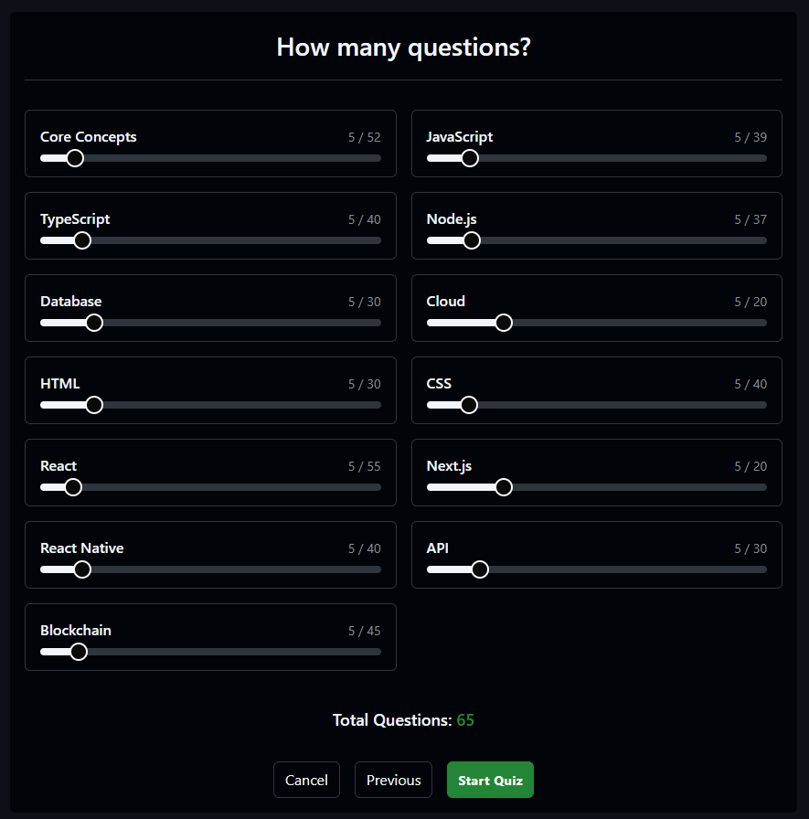

# Emanuele Sgroi Portfolio

> **A GitHub-inspired developer portfolio built with Next.js, Tailwind CSS, Prisma, Supabase & OpenAI (ManuPilot).**

🔗 Live demo: https://www.emanuelesgroi.com/


## Table of Contents

- [Overview](#overview)
- [Features](#features)
- [Screenshots](#screenshots)
- [Tech Stack](#tech-stack)
- [Installation & Setup](#installation--setup)
- [Usage](#usage)
- [License](#license)
- [Contact](#contact)

---

## Overview

This repository contains the full source for [emanuelesgroi.com](https://www.emanuelesgroi.com/), a personal portfolio by **Emanuele Sgroi**. The site mimics GitHub’s minimalist UI and adds interactive features:

- **Interactive contribution chart** (type a word → mapped to “contributions”, emoji theme also available)
- **Dev-Quiz**: customizable coding quizzes with explanations & scoring
- **Discussions**: Markdown-powered comments stored via Prisma + Supabase
- **Multilingual**: English en & Italian 🇮🇹, auto-detected or cookie-controlled
- **Dark/light themes** + GitHub-style navbar & profile bar
- **ManuPilot AI**: immersive Copilot-style page + quick-chat widget (30-message/3-h quota)

All portfolio content (projects, writings, ManuPilot prompts) is managed in Contentful for easy updates.

---

## Features

- **Welcome (/)**
  - GitHub-style profile README, pinned projects, interactive contribution chart
- **Portfolio (/portfolio)**
  - Repo-style & grid views of projects fetched from Contentful
- **Writings (/writings)**
  - Blog grid + academic papers by year (PDF downloads)
- **Dev-Quiz (/dev-quiz)**
  - Select topics & number of questions → instant feedback & score
- **Discussions (/discussions)**
  - GitHub-like Markdown comments with threading
- **Contact (/contact)**
  - Simple email form
- **About This Website (/about-this-website)**
  - Docs on how and why the site was built
- **ManuPilot AI (/manupilot)**
  - Full-page chat UI, file attachments, streaming responses
- **Quick Chat Widget**
  - Collapsible Copilot-style chat on all pages; attach project context
- **Rate Limiting**
  - 30 messages per 3h per anonymous user (signed cookie + IP fallback)
- **Multilanguage & Theming**
  - English/Italian toggle, dark/light mode
- **Search**: press `/` to open the navbar search

---

## Screenshots of pages

### Welcome


### Portfolio


### Project Details


### Writings


### Blog Post


### Dev-Quiz





### Discussions


### Contact


### ManuPilot Page


### Quick Chat Widget


### Search


\*_ AND MORE_

---

## Tech Stack

- **Next.js (App Router)** – server-side rendering & API routes
- **Tailwind CSS** – utility-first styling
- **Prisma + PostgreSQL (Supabase)** – discussion storage & quota tracking
- **Contentful CMS** – dynamic content (projects, writings, AI prompts)
- **OpenAI GPT-4** – ManuPilot chat (streaming + summarization)
- **React Context** – chat & quota state management

And more. See the 

---

## Installation & Setup

To set up the project locally, follow these steps:

1. **Clone the repository**:

   ```bash
   git clone [https://github.com/Emanuele-Sgroi/emanuelesgroi.com.git](https://github.com/Emanuele-Sgroi/emanuelesgroi.com.git)
   ```

2. **Navigate to the project directory**:

   ```bash
   cd emanuelesgroi
   ```

3. **Install dependencies**:

   ```bash
   npm install
   ```

4. **Create an `.env.local` in root:**

   ```env
   NEXT_PUBLIC_CONTENTFUL_SPACE_ID=xxxxxxxx
   NEXT_PUBLIC_CONTENTFUL_ACCESS_TOKEN=xxxxxxxx
   NEXT_PUBLIC_CONTENTFUL_PREVIEW_TOKEN=xxxxxxxx
   NEXT_PUBLIC_EMAILJS_SERVICE_ID=xxxxxxxx
   NEXT_PUBLIC_EMAILJS_TEMPLATE_ID=xxxxxxxx
   NEXT_PUBLIC_EMAILJS_PUBLIC_KEY=xxxxxxxx
   NEXT_PUBLIC_AUTHOR_NAME=xxxxxxxx
   OPENAI_API_KEY=xxxxxxxx
   NEXT_PUBLIC_BASE_URL=https://www.emanuelesgroi.com/ ## Change with your base url
   SIGNING_SECRET=xxxxxxxx
   ```

**Create an `.env` in root:**

```env
DATABASE_URL=xxxxxxxx
SUPABASE_PASS=xxxxxxxx
```

5. **Run migrations (Prisma → Supabase)**

   ```bash
   npx prisma migrate deploy
   ```

6. **Generate Prisma client**

   ```bash
   npx prisma generate
   ```

7. **Start dev server**

   ```bash
   npx prisma generate
   ```

---

## Usage

- Navigate to http://localhost:3000/
- Explore pages from the GitHub-style navbar
- Open the Quick Chat widget (bottom-right) or visit /manupilot
- Chat with ManuPilot (30 messages per 3 h, resets automatically)
- Switch languages via the site footer or cookie toggle
- Toggle dark/light mode with the theme icon

---

## License

This project is released under a custom license:

You are free to use or adapt this code for your own portfolio/website — provided you

1. Remove all references to “Emanuele Sgroi” (name, branding, screenshots)
2. Credit the original author (e.g. in your own README or footer)

See  for full text.

---

📧 em.sgroi@gmail.com
🌐 https://www.emanuelesgroi.com/
